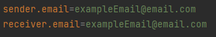

## Camunda Platform 8 Email Sender Job Worker Using Docker

### Set up the project using docker compose

The full environment contains these components:
- Zeebe
- Zeebe Send Email Worker

To start your environment use the following command:

```
docker-compose up -d
```

Now you can use Zeebe with the following port:
- Zeebe: [http://localhost:26500](http://localhost:26500)

To stop the environment run the following command:

```
docker-compose down -v
```

In the [ZeebeSendEmailWorker/src/main/resources](ZeebeSendEmailWorker/src/main/resources) file you can find a sample .bpmn process that can be deployed and that works with...
the Job Worker.


### How to define your host and port for the smtp.

You can either do it via your docker compose as follows:


Or through the application.properties: 


### How to define inputs for the email 

It is possible to do it with the .bpmn file:


Alternatively, you can define the sender and receiver with the application.properties file:

